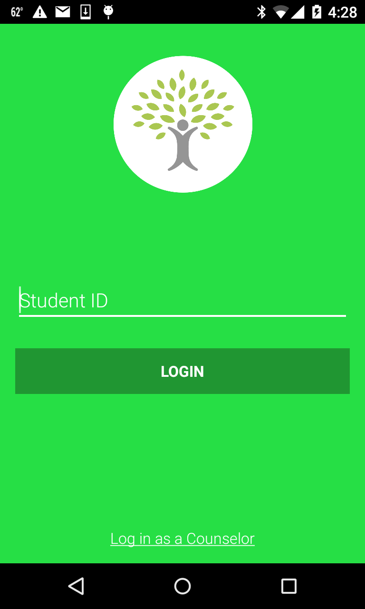
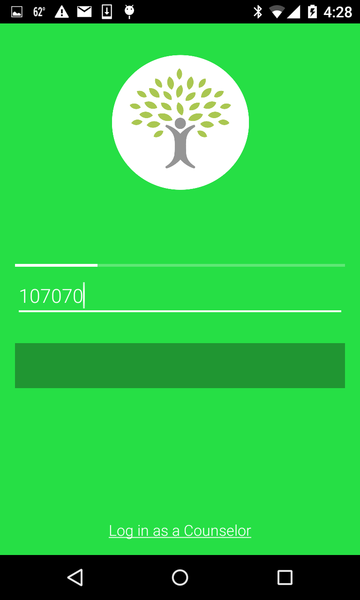
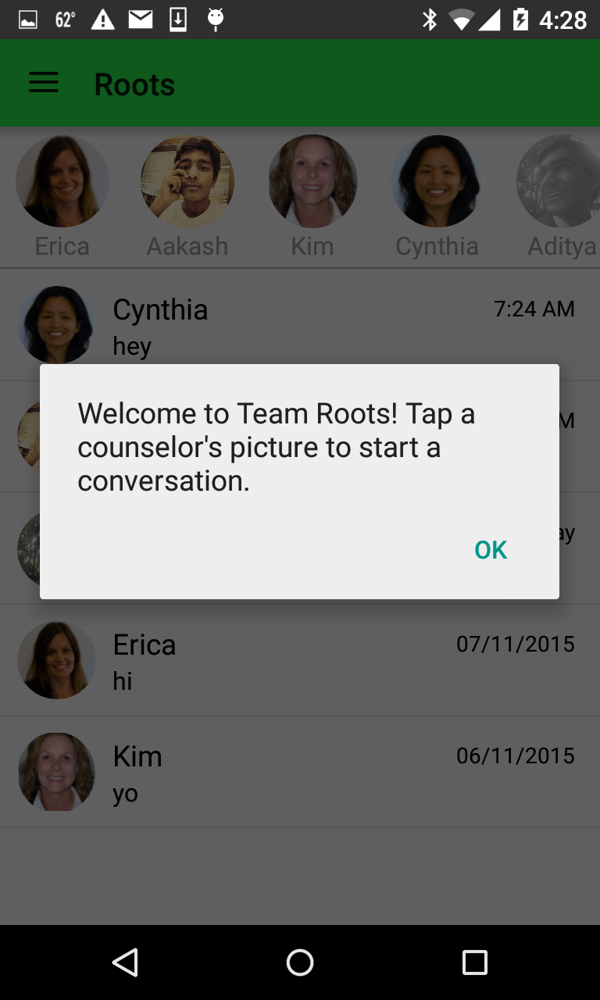
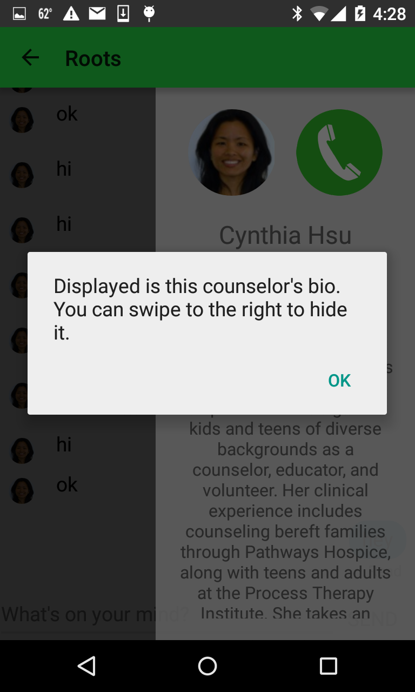
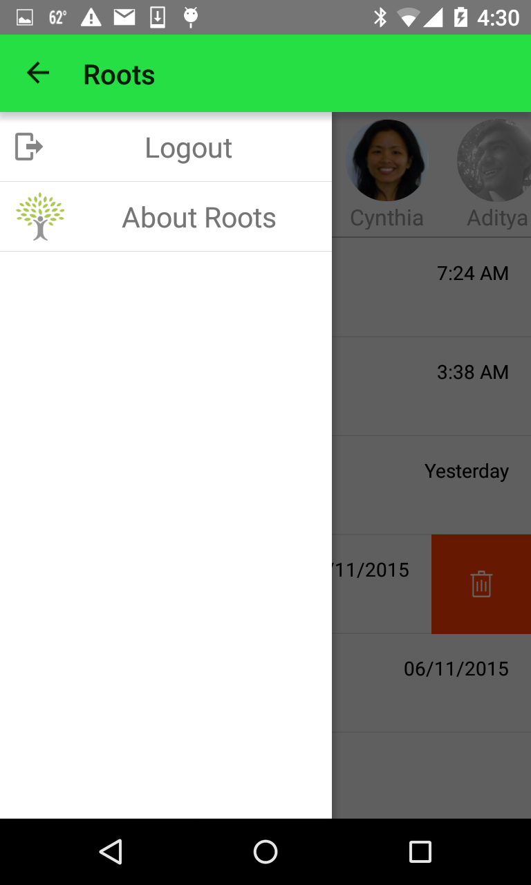
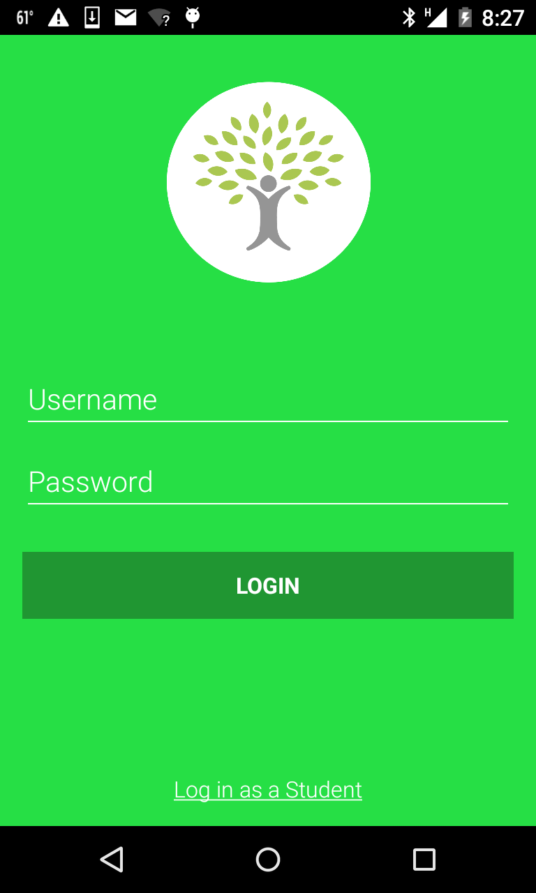
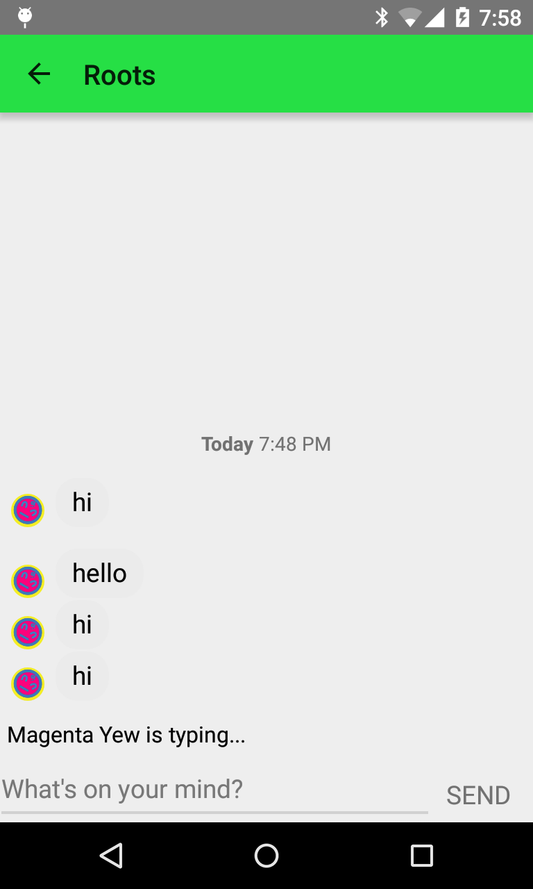
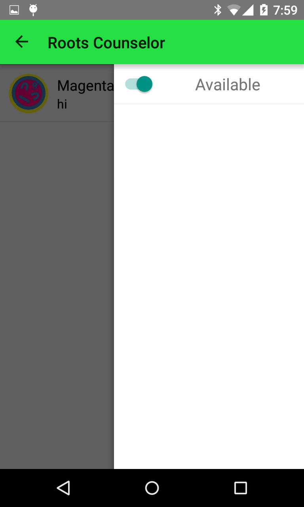
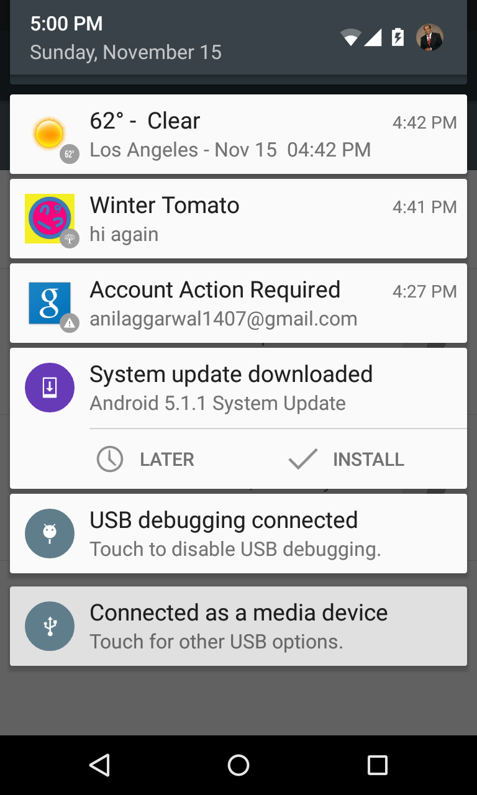

Note: Roots for Android is currently a **Preview Release**. This repository will be updated substantially in the coming weeks.
   

##Roots for Android: Preview Release Overview
 
Roots is an app students use to instant message counselors anonymously when they need help, and the non-anonymous counselors can provide help by continuing the conversation over the app. The app provides a way for people to seek help from people within their communities without identifying themselves.    
Roots' potential customers are residential housing at USC, charter high schools in Los Angeles and the Bay Area, and small business companies seeking a private, continuous, and anonymous feedback stream, starting with <a href="http://www.milestoneinternet.com/"> Milestone Internet Marketing</a>.

  

##Screen Shots
 

</img>
</img>
</img>
</img>
</img>
</img>
</img>
</img>
</img>

##Credits

* [Aditya Aggarwal](https://github.com/AdityaAgg)
* [Ryan Anderson](https://github.com/rkanderson)

  
Roots has used Layer to support its backend. If you have any technical questions or concerns about Layer, please feel free to reach out to [Layer Support](mailto:support@layer.com).

 
 
© Copyright TeamRoots 2014-2015
